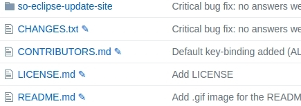

# GitHub Fast Edit

Chrome extension that adds an edit button next to files on GitHub.

## Installation

1. Download the plugin folder
2. Go to `chrome://extensions/`
3. Click "Load unpacked extension..." and select "plugin" folder

Note: Tick the "Allow in incognito" chekcbox if you want the plugin to be available in incognito mode.
